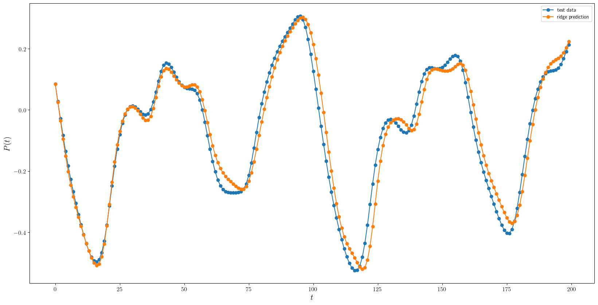

# Resevoir Computing and modelling Echo State Networks

## Installation
### Requirements
- Python **3.9 or later**
- `git`
- `pip`
- `numpy`
- `jupyterlab`

### Clone repository
Open your terminal and go to the folder were you want to install this code. Once there, you would run the following code:
```bash
git clone https://github.com/ivanMC-A/CompPhysProject.git
cd CompPhysProject
```
The latter line is to move to the code's folder.

### Verify Installation

You can verify that everything is set up correctly by running:

```bash
jupyter lab rnnExamples.ipynb
```
## Example Usage
  This section is used to show the intended workflow and usage of our code.
### Basic Example
The following example shows how to use import our code and a small demonstration.
```python
import numpy as np
import RNN as rnn
import matplotlib.pyplot as plt
```
You will need data you want to predict.
```python
dataMg17 = np.loadtxt('data/mackeyGlass/MackeyGlass_t17.txt')
```
For this example, we will use the Mackey Glass data. Since this is a RNN to predict time series, we want that our row corresponds to time. We proceed to reshape our data.
```python
dataMg17 = np.reshape(dataMg17, (1, dataMg17.shape[0]))
```

Now, we proceed to train our data.

```python
# Set the training and testing parameters
res_size = 400
train_legnth = 200
train_skip = 0
test_legnth = 200

# Select data based off training and testing parameters
u_train = dataMg17[:, 0:train_legnth]
y_train = dataMg17[:, 1:train_legnth + 1]
u_test = dataMg17[:, test_legnth ]

# Initialize resevoir
mgESN = rnn.ESN(res_size, seed = 125)

# Train resevoir
mgESN.fit(u_train, y_train, method = "ridge", train_skip=train_skip)
```
The last line generates an out weight matrix that will be useful for predictions. Notice that we have optimized our out weight matrix with Ridge regression. Now, we proceed to predict some data.

```python
y_test = dataMg17[:, test_legnth + 1 : test_legnth + test_legnth + 1]
y_ridge_predict = mgESN.predict(u_init=u_test, test_length=test_legnth)
```

Here is a plot of our predictions
```python
plt.figure(figsize=(20,10))
plt.plot(range(test_legnth),y_test[0],'o-',label='test data')
plt.plot(range(test_legnth),y_ridge_predict[0],'o-',label='ridge prediction')
plt.legend()
plt.ylabel(r"$P(t)$")
plt.xlabel(r"$t$")
```


### Example Script
A complete, minimal working example can be found in file `rnnExamples.ipynb`. This is the same file mentioned in the installation section. Once in the project's folder in your terminal, you can run the minimal example by running the following line:

```bash
jupyter lab rnnExamples.ipynb
```

This notebook does the following:

* Imports core functionalities
* Set ups the problem
* Executes main computations
* Plots results

## Project Description
As AI and machine learning become more prevelant in society, finding device architecture to match the software needs becomes increasingly important. Resevoir computing is a way to use optical integration into existing silicon infrastructure to realize these needs. A resevoir computer as in Brunner, _et al_., creates a system similar to an echo state network in the time domain, where the weighting matrix is confined by the components and material characteristics. Here we will create a toy model by designing an echo state network that fits and predicts a function of Mackey Glass type. 

## Project Structure
As given in the example, we will first begin with an attempt to create a main python file that contains our echo state network class in a subdirectory which is run by a top-level demo file. This demo file will run our simulation and create sample graphics that demonstrate the results.

## Project Process
1. Impliment the portion of the file responsible for loading in data files and storing it in an appropriate data structure.
2. Create an echo state network solver based on the Mackey-Glass family of delayed differential equations.
3. Design functions to allow data and prediction capabilities to be shown in a visually appealing manner.
4. If time allows, attempt to adjust parameters based on true material capabilities and archetechtures to model a true system. 

## Delegation
- Pablo will work on graphic implimentation and work on the presentation and background.
- Jason will work on class definitions and ensuring the model and presentation are structured to work towards the goal of modeling optical networks such as in Brunner, _et al_.
- Ivan will work on graphic implimentation and help with the implimentation of auxillary class functions.

## Background
The systems modeled in this problem are simple toy models relevent to networks as reported in 
[1] D. Brunner, _et al_., Journal of Applied Physics 124, (2018).
